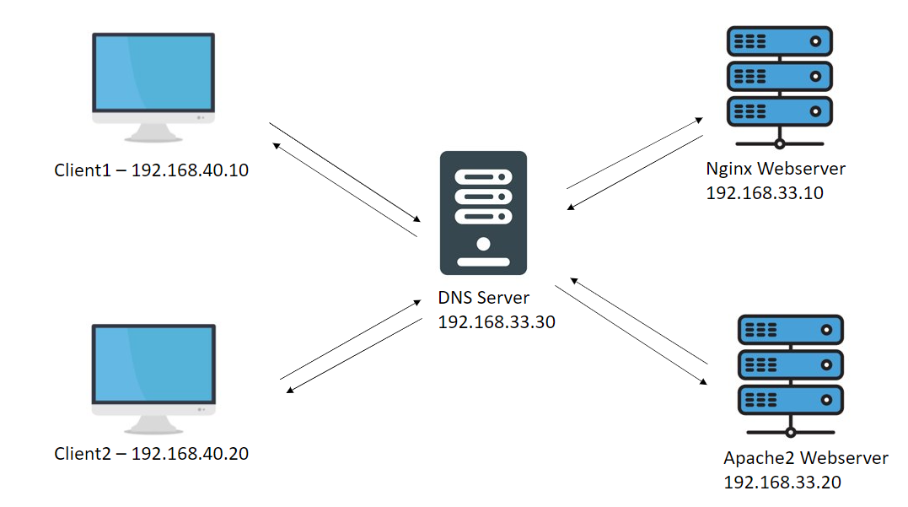

# Step-by-step of configuration DNS using bind9
---
Our working model


---
Configuration

First of all we need to install bind9 on our Debian server:
```
apt-get install bind9 -y
```
Our configuration files are located in default bind9 directory __/etc/bind__
```
root@dns:/etc/bind# ls
bind.keys  db.127  db.255    db.local    named.conf.default-zones  named.conf.options  zones.rfc1918
db.0       db.192  db.empty  named.conf  named.conf.local          rndc.key
```
For creating zones we have file __named.conf.default-zones__
This is default content
```
// be authoritative for the localhost forward and reverse zones, and for
// broadcast zones as per RFC 1912
zone "localhost" {
        type master;
        file "/etc/bind/db.local";
};
zone "127.in-addr.arpa" {
        type master;
        file "/etc/bind/db.127";
};
zone "0.in-addr.arpa" {
        type master;
        file "/etc/bind/db.0";
};
zone "255.in-addr.arpa" {
        type master;
        file "/etc/bind/db.255";
};
```
But for us we need to create our own zones and files for them
1. First we create our own zones in file __named.conf.default-zones__
```
zone "ars" {
       type master;
       file "/etc/bind/db.local";
};

zone "33.168.192.in-addr.arpa" {
        type master;
        file "/etc/bind/db.192";
};
```
Type that we use it is master, or slave if we using some chile machines for our server and we specify there file with records.
2. Configure zone file for A, TXT, SOA etc. records. This is will be file __db.local__ but in can be any
```
root@dns:/etc/bind# cat db.local
;
; BIND data file for local loopback interface
;
$TTL    604800
@       IN      SOA     ars. root.ars. (
                              2         ; Serial
                         604800         ; Refresh
                          86400         ; Retry
                        2419200         ; Expire
                         604800 )       ; Negative Cache TTL
;
@       IN      NS      ns.ars.
ns      IN      A       192.168.33.30
web1    IN      A       192.168.33.10
web2    IN      A       192.168.33.20
nginx   IN      CNAME   web1
web1    IN      TXT     "Example of info record for web1"
```
There we create 3 A records, 2 of them for our webservers, and another one for NS(Name System) server - it is IP address of our DNS server. We need it for correct work of DNS resolver. CNAME record it is just like synonym
3. Configure zone file for PTR records for resolving ip --> domain name. There we use file __db.192__ (It is like reverse A record, AAAA also can be)
```
root@dns:/etc/bind# cat db.192
;
; BIND reverse data file for broadcast zone
;
$TTL    604800
@       IN      SOA     localhost. root.localhost. (
                              1         ; Serial
                         604800         ; Refresh
                          86400         ; Retry
                        2419200         ; Expire
                         604800 )       ; Negative Cache TTL
;
@       IN      NS      localhost.
10      IN      PTR     web1.ars.
20      IN      PTR     web2.ars.
```
There we have 2 PTR records and we do that, if client will do request by ip address, not by domain name. And DNS server resolve ip address and it will give for our client domain name.
4. Save all files and check if our syntax is correct using command
```
named-checkconf
```

5. Final step - restart our bind service using command
```
systemctl restart bind9
```


###Clients of our DNS server
For our clients we need to specify the DNS server in our system. 
For example in Linux systems we can specify it in file __/etc/resolv.conf__
```
nameserver 192.168.33.30
```
###Testing
And now we can test it using some networking CLI tools in Linux to test our DNS server. 
There we are checking some A, CNAME, TXT records.
1. NSLOOKUP tool
```
root@external1:~# nslookup nginx.ars
Server:         192.168.33.30
Address:        192.168.33.30#53

nginx.ars       canonical name = web1.ars.
Name:   web1.ars
Address: 192.168.33.10

root@external1:~# nslookup web1.ars
Server:         192.168.33.30
Address:        192.168.33.30#53

Name:   web1.ars
Address: 192.168.33.10

root@external1:~# nslookup web2.ars
Server:         192.168.33.30
Address:        192.168.33.30#53

Name:   web2.ars
Address: 192.168.33.20

root@external1:~# nslookup 192.168.33.20
20.33.168.192.in-addr.arpa      name = web2.ars.
```
2. DIG tool
```
root@external1:~# dig web1.ars +short
192.168.33.10
root@external1:~# dig web2.ars +short
192.168.33.20
root@external1:~# dig web1.ars +short TXT
"Example of info record for web1"
```

###P.S.
If you wanna to check more information how to configure DNS server using bind9 you can check official documentation https://bind9.readthedocs.io/en/latest/
